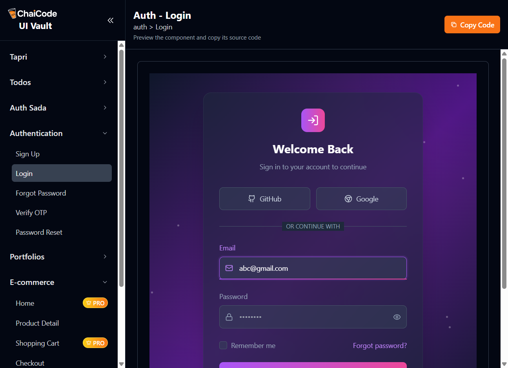
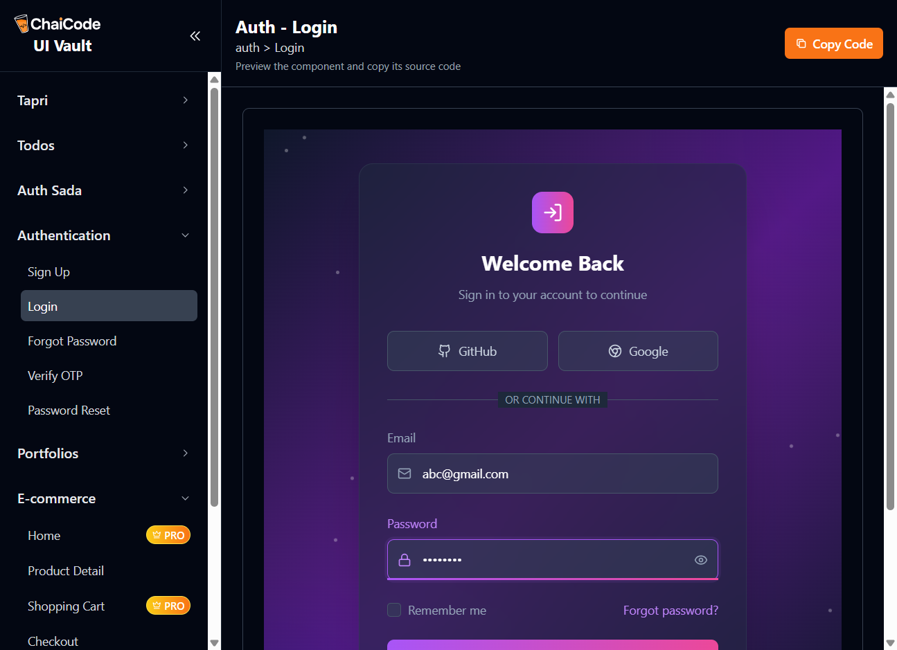

# ⚡ Automation AI Agent  

Meet the **Automation AI Agent** — your terminal buddy that can chat 💬, think 🤖, and *do stuff* for you!  
From answering questions to running tools to automating your browser 🖥️, this agent takes you one step closer to agentic AI 🚀.  

---

## 🛠 Tech Stack  

Built with a mix of cool tools and powerful APIs:  

- **[Node.js](https://nodejs.org/)** – The backbone of the CLI agent 🟢  
- **[Playwright](https://playwright.dev/)** – For browser automation & magic clicks 🖱️✨  
- **[OpenAI SDK](https://platform.openai.com/)** – The “brain” 🧠 behind conversations  
- **Chalk / CLI Styling** – To keep your terminal looking fresh 🌈  
- **Zod** – Type safety for cleaner input validation ✅  

---

## 🚀 Features  

- 💬 **Chat naturally** with your agent  
- 🛠 **Tool calling** for real actions (not just text!)  
- 🌐 **Browser automation** with Playwright  
- 🎨 Fancy CLI with gradient colors & icons  

---

## 📦 Installation  

Spin it up in just a few steps 🏃‍♂️💨  

```bash
# 1️⃣ Clone the repo
git clone https://github.com/TrilochanSahoo/automation-ai-agent

# 2️⃣ Move into the project folder
cd automation-ai-agent

# 3️⃣ Add .env file and your Open Ai API key
OPENAI_API_KEY = "Your API Key"

# 4️⃣ Install dependencies
npm install

# 5️⃣ Run the CLI agent
node index.js
```

## 📸 Demo Screenshots

Here’s how the CLI in action:
## Screenshots
<p align="center">
  
</p>

<p align="center">
  
</p>

<p align="center">
  
</p>

<p align="center">
  
</p>

## 📸 Demo Video link
👉 [Watch the Demo](https://x.com/Trilochan026/status/1961370933542727733)

